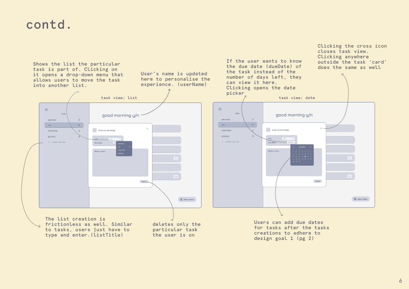

# Meet Anu; A to-do list designed with the human experience in mind
## Introduction; Why a To-Do List?
I have tried a dozens of todo's applications, all promising to be 'life organising' but struggled to stick with any beyond a couple of weeks. Initially, I thought the problem was with myself- **I lacked discipline, organization and grit** to keep up. However, *In Design of Everyday Things*, Norman asserts that there is no “human error,” **only bad design**. 

With this new found hope, I designed and developed *Anu*- a **humane** approach to task management that avoids decision fatigue by focuing on **simplicity** and **speed** to keep users organized and motivated without the overwhelm of endless functionalities and integrations. With Anu, I hope to encourage a kind, mindful way to manage tasks that foster a sense of **clarity** and **calm** amidst the chaos of daily life.

## Features
Using this application as my primary to-do list during its development provided great insight into which features I needed, and which were futile. Below are the ones I ended up with: 
#### ✍️ Create tasks 
#### 🗓️Set due dates for ones with deadlines
#### 📝 Organizing them into lists, with the option to customize colors as tags
#### 🏠 Viewing all tasks in one place, enabling creation of tasks that don't belong with any specific list
#### 👆 Drag-and-drop around for easy reordering
#### ✏️ Renaming/editing lists & tasks (mistakes happen all the time!)
#### 🗑️ Deleting them as needed
I removed the notes feature from the initial data model as I never saw the need to use it during the 3 weeks I developed this. However, although editing a task wasn't part of the brief, i felt it much more necessary to be be able to do so in this context, and hence decided to implement this instead. The goal of this project is to be an mvp of a simple, usable to-do list that I can actually start sending out to users/start using. 

## Tech Stack
...and that brings us to Tesler’s Law- "complexity cannot be designed away and therefore must be assumed by either the system or the user". Essentially, when you design something that is easier for someone to use; while you’ve reduced the complexity for that person, you have also increased it for yourself behind the scenes, and that seems to be the case here as well :) 

Below is a brief rationale of the application's 'complex' build for it's fairly basic features:
#### UI Components
- **Heroicons:** Simple, easy to integrate static icons
- **Lordicons:** Animated icons for an engaging ux
#### Front-end Frameworks & Libraries 
- **React.js:** Facilitates the creation of reusable, stateful components. Virtual DOM ensures efficient rendering and updates, essential for a responsive task management interface. 
- **React-calendar:** Provides a customizable calendar component
- **Atlassian's** react-beautiful-dnd: Enables smooth drag-and-drop interactions. 
- **React-Markdown** with Remark-GFM plugin: Allows rich text formatting.
- **React-router-dom:** Manages dynamic navigation within single-page the applications (SPA) architecture. 
- **Redux saga:** Efficiently handles asynchronous operations.
#### Styling and Design 
- **TailwindCSS with PostCSS plugin:** Utility-first CSS framework for rapid UI development with a consistent design system. PostCSS optimizes CSS output, reducing file sizes and improving load times.
#### Development tools and Language 
- **Typescript:** Enhances JavaScript with static typing, reducing runtime errors and improving code quality through early detection of type-related bugs. Essential for maintaining a large codebase.
- **Vite:** Provides fast development and builds with instant HMR.
### Hosting and Deoployment
- **Github:** Repository hosting and version control (although I only used it in my final stage of development. To view early versions of the code and further insight on development process visit- https://www.figma.com/design/mXP0uRyY09puysDa9I7NYG/Untitled?node-id=1-5022&t=mAXTb3nHE3Uvbhms-1 )

github repository link: https://github.com/speakingofsneha/a3-web-app-prototype 

## Instructions 
### To run the application locally:
#### 1. Clone the Repository
- Open your terminal and run the following command to clone the repository: "git clone https://github.com/speakingofsneha/a3-web-app-prototype.git" 
#### 2. Install Dependencies
- Navigate into the project directory: "cd a3-web-app-prototype"
- Install the necessary dependencies by running: "npm install"
#### 3. Run the Development Server
- Once the installation is complete, start the development server with: "npm run dev"
- This will launch a local server, and you can view the application by opening your browser and navigating to:  
http://localhost:4000/anu 

## Design 
The goal was to design something that users would actually want to use everyday. Hence, inspired by apps that I enjoy use daily (Arc, Headspace and Apple), I designed the following:

I conducted multiple rounds of usability testing throughout the design process, and iterated along the way based on user feedback and my own experience using it to manage tasks. 

To view all the iterations in detail visit https://www.figma.com/design/mXP0uRyY09puysDa9I7NYG/A2-Web-App-Design?node-id=1-1618 

## Reflection
### What went well
- Human-centered design: The design process was heavily influenced by user feedback and personal experience, resulting in a user-friendly interface that prioritizes simplicity and usability.
- Implementation of industry standard technologies: Leveraging a robust tech stack (React.js, TailwindCSS, TypeScript) ensured a responsive, efficient, and maintainable application.
- Smooth Development Workflow: Utilizing tools like Vite and GitHub streamlined the development process, making it easier to manage, build, and deploy the application. 

### Areas for improvement
- Lack of Version Control: Implementing version control from the beginning would have greatly helped  better manage code changes and track progress. 
- Code Documentation: As mentioned in the rubrics, I commented through the code to explain it's functionality. However looking back, instead of commenting on **what the code did**, I wish I commented **why I was doing it that way**. I learnt that good code is obvious enough to everyone (including myself) and very rarely needs commenting on what it does. This is the approach I hope to take for my future projects.  

### Considerations for future developers 
- **Strive to build features that add value without adding unnecessary complexity for the user**- Building this has taught me how things that seem “simple” are often quite complex. But **complex doesn’t have to be complicated**. Humans expect and enjoy robust, multi-featured tools. What they don’t want is for those tools to be needlessly difficult. 
- Consider adding more personalization features as welll, such as **custom themes and user preferences**, to enhance ux

## Acknowledgements
### References
1. Matuschak, A. (n.d.). Close_open_loops [notes on Andy Matuschak's website].Retrieved from: https://notes.andymatuschak.org/Close_open_loops?stackedNotes=z5tiFxnNKMZCnc8G9R1N51L5hknyRGmyCQx18&stackedNotes=z8aZybuJJopS5fL7TnPou2JcmCsBUJeqirbBh&stackedNotes=z5vXaKVAPBNKAAi9RXNudduhyGadGXqtMVTEs
2. Norman, D. A. (2013). The design of everyday things. MIT Press.
3. Laws of UX (2020, March 2). Tesler's Law. [Laws of UX]. https://lawsofux.com/teslers-law/

References used when building the application
1. Code academy's cheat sheets: 
2. Existing TypeScript based To-do projects. Allthough the final product is vastly different, viewing existing project's improved my understanding of typescript, how to structure code, what technologies to implement. Examples include: 
    - https://github.com/gyenabubakar/tasksheet-app 
    - https://github.com/peguimasid/task-it 
    - https://github.com/CodeItDownYt/React-Task-Management 
    - https://github.com/Un1T3G/nextjs-task-management-app 
    - https://github.com/etrobert/taskgraph 
    - https://github.com/chandrasekhar2039/TODO https://github.com/Praisecodes/dentask 

### Ai usage
I primarily utilized ChatGPT for:
- Assisting with debugging tasks
- Enhancing and refining comments to ensure comprehensive explanations of the code's functionality

